# Instructions to work with extension

To activate the extension to work with the next js project add `"activate_nextjs_extension": true` to the `package.json` file.

### Generate page with utils, module and component

- Install the .vsix file.
- Reload vs code `ctrl+shif+p` command and search for `Reload Window` and click enter.
- New collapsable option will show on the explorer tab.
  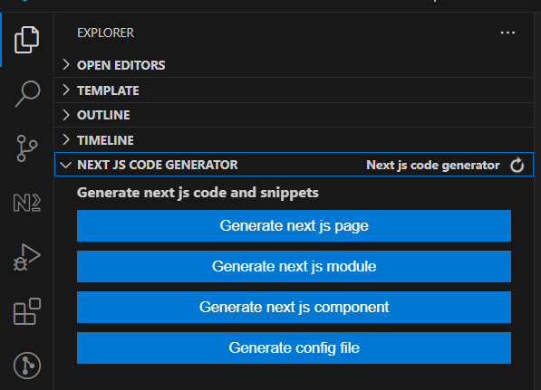
- To activate the extension click on `Activate` button as shown.
  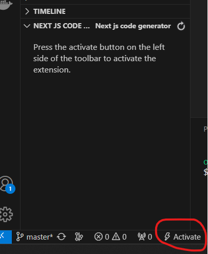
- `package.json` file will be updated with new option `activate_nextjs_extension`.
  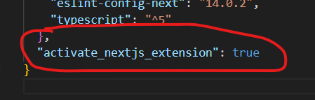
- To deactivate the extension click on `Deactivate` button as shown.
  
- The `activate_nextjs_extension` option from `package.json` file will be set to `false`.
  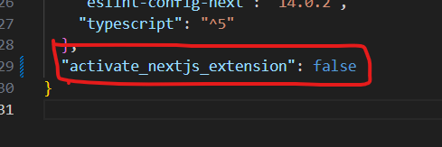
- Note that if you remove `activate_nextjs_extension` from `package.json` the extension it will be deactivated.
- Other ways to use the extension.
- Press again `ctrl+shif+p` command and search for `Generate Next Page` and click enter.
  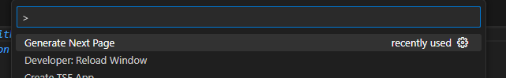
- It will open an input where you can specify the page path, for example `foo/bar` and the page will be created on the directory `bar` inside the `foo` directory, to create dynamic routes you can specify the path just witht the format of a dynamic route for example `foo/bar/[fooid]` and it will generate a page folder `[fooid]`.
  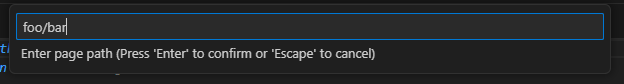
  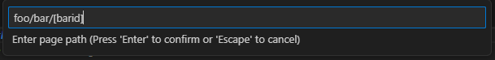
- After specifying the page path you wil be asked if you want to add page module to work witj client side libraries such as `react-query`, the default value is `Yes` and any other value it will resulte to `No`.
  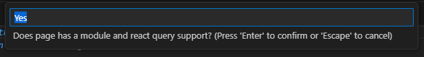
  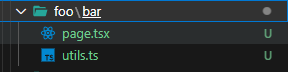
  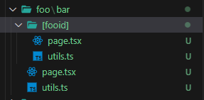

- Alongside it will be generated a utils file per page and if choosed it will be generated a module file and a component file

### Generate only module and component

- Press again `ctrl+shif+p` command and search for `Generate Next Module` and click enter.
  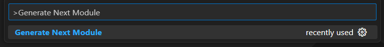
- After entering module name type `Yes` if you want to create a component for the module
  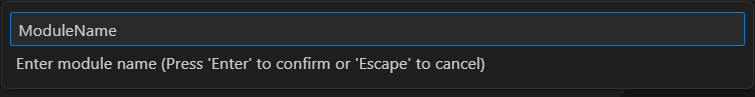
  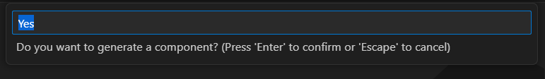

### Generate only component

- Press again `ctrl+shif+p` command and search for `Generate Next Component` and click enter.
  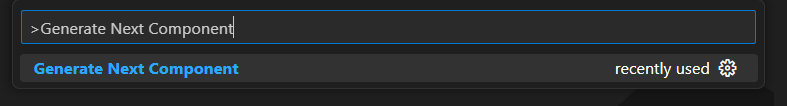
  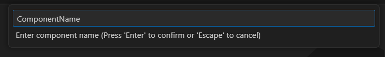

# Using custom paths to generate files

- Press `ctrl+shif+p` command and search for one of commands `Generate Next Config`, `Generate Next Module` or `Generate Next Component` and click enter.
  
- A file named `gen.json` will be created to the root of the directory project.
  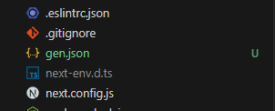
- From the config you can specify the custom folder paths where you want to generate files
  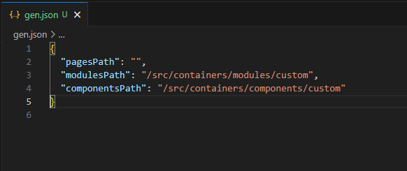
- Leaving path as empty strings or removing from the config file will fallback to the default paths

### `gen.json` file structure

```json
{
  "pagesPath": "/src/customapp",
  "modulesPath": "/src/containers/custommodule",
  "componentsPath": "/src/containers/customcomponent"
}
```

# Using code snippets to generate content

- use `pg` snippet for generating a next page
- use `pg-with-mod` snippet for generating a next page with react query and module support
- use `pg-util-mod-par` snippet for generating a next page utils content with react query support and params interface (useful if using dynamic routes, and module support)
- use `pg-util-par` snippet for generating a next page utils content with params interface (useful if using dynamic routes)
- use `pg-util-mod` snippet for generating a next page utils content with react query support
- use `pg-util` snippet for generating a next page utils content
- use `pg-module` snippet for generating a next module content
- use `pg-module-ctx` snippet for generating a next module content with react context api provider
- use `pg-provider-ctx` snippet for generating a react context api provider content for the module
- use `pg-component` snippet for generating a next component content
- use `pg-component-ctx` snippet for generating a next component content with react context api provider hook imported
