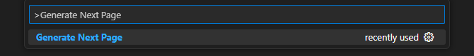

# Instructions to work with extension

- Install the .vsix file.
- Reload vs code `ctrl+shif+p` command and search for `Reload Window` and click enter.
- Press again `ctrl+shif+p` command and search for `Generate Next Page` and click enter.
  
- It will open an input where you can specify the page path, for example `foo/bar` and the page will be created on the directory `bar` inside the `foo` directory, to create dynamic routes you can specify the path just witht the format of a dynamic route for example `foo/bar/[fooid]` and it will generate a page folder `[fooid]`.
  
  
- After specifying the page path you wil be asked if you want to add page module to work witj client side libraries such as `react-query`, the default value is `Yes` and any other value it will resulte to `No`.
  
  
  

- Alongside it will be generated a utils file per page and if choosed it will be generated a module file and a component file

# Using custom paths to generate files

- Press `ctrl+shif+p` command and search for `Generate Next Config` and click enter.
  
- A file named `gen.json` will be created to the root of the directory project.
  
- From the config you can specify the custom folder paths where you want to generate files
  
- Leaving path as empty strings or removing from the config file will fallback to the default paths

### `gen.json` file structure

```json
{
  "pagesPath": "/src/customapp",
  "modulesPath": "/src/containers/custommodule",
  "componentsPath": "/src/containers/customcomponent"
}
```
